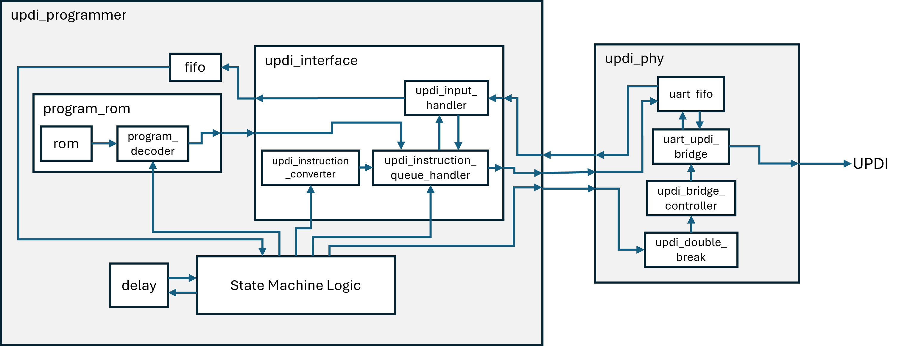

# updi-fpga
Programming an ATtiny816 via [UPDI](https://onlinedocs.microchip.com/oxy/GUID-19DFE3E8-6314-4CFE-BA69-1357E28C8092-en-US-1/GUID-A2FD739F-A1D8-4C2F-9482-0B8AF9DCF435.html) using an FPGA.

## Overview
The top-level module has two modules contained inside of it, `updi_programmer` and `updi_phy`. 
The `updi_programmer` module is responsible for all of the logic involved in programming the UPDI-capable microcontroller. 
The `updi_phy` module is responsible for taking the input/output bytes from the programmer module and converting it into a half-duplex UART stream (i.e., UPDI). In addition, this module is responsible for performing 'double breaks', which effectively reset the UPDI chip. 
The two modules interface with each other via two FIFO interfaces. A block diagram showing the overall design is shown below: 

Note that for the main simulation, the `updi_phy` module is substituted for an implementation in C++.

## Simulating
### Prerequisites
[Verilator](https://www.veripool.org/verilator/) is used to simulate the design (note: version >5.x required which is not installable with `apt`, see [installation directions here](https://verilator.org/guide/latest/install.html#git-quick-install)). 
[Libserial](https://github.com/crayzeewulf/libserial) is used to interface with a connected USB to UART converter (`sudo apt install libserial-dev`). 
In addition, `intelhex` is a required Python package (`pip3 install intelhex` or `sudo apt install python3-intelhex`). 
All other dependencies should be installed during the installation process for these.

### Main Simulation
The main simulation simulates just the `updi_programmer` module and interfaces with a USB to UART converter to send bytes to a physically connected UPDI-capable device. 
Run `make sim` to compile the simulation binary, or `make sim_run` to compile and run the simulation. 
The assumptions of the simulation are that a USB to UART converter is plugged in on `/dev/ttyUSB0`, and a [UART to UPDI cable](https://github.com/SpenceKonde/AVR-Guidance/blob/master/UPDI/jtag2updi.md#connections) is attached to the output of this.

### Running Tests
Each individual test will be compiled to its own binary 
Run `make test` to build the binaries, or `make test_run` to build and run all binaries. 
For building/running individual tests, use `make test_NAME` and `make test_run_NAME`, respectively.

## Hardware
This project was tested with a [Digilent Arty A7-100T](https://digilent.com/shop/arty-a7-100t-artix-7-fpga-development-board/) development board. 
The Vivado project file `updi-fpga.xpr` is included with all configurations needed for bitstream generation. 
Currently, it is configured so that the UPDI signal is on `IO1`, the start button is `BTN0`, and the 'busy' LED is `LD4`. This can be modified in `src/constraints/arty-a7-100t.xdc`. 
As of now, the design appears to be fully working in hardware :)

## Potential Future Improvements
- Make it easier to adapt for other microcontrollers, which may have things mapped for different memory locations.
- Use Vivado's CLI tools to make it easier to build bitstreams.
- A smarter watchdog system that could perhaps just retry the last thing instead of fully resetting upon an error.
- Verify flashed program after programming is finished.
- Virtual UPDI-capable MCU for simulation (maybe overkill).
